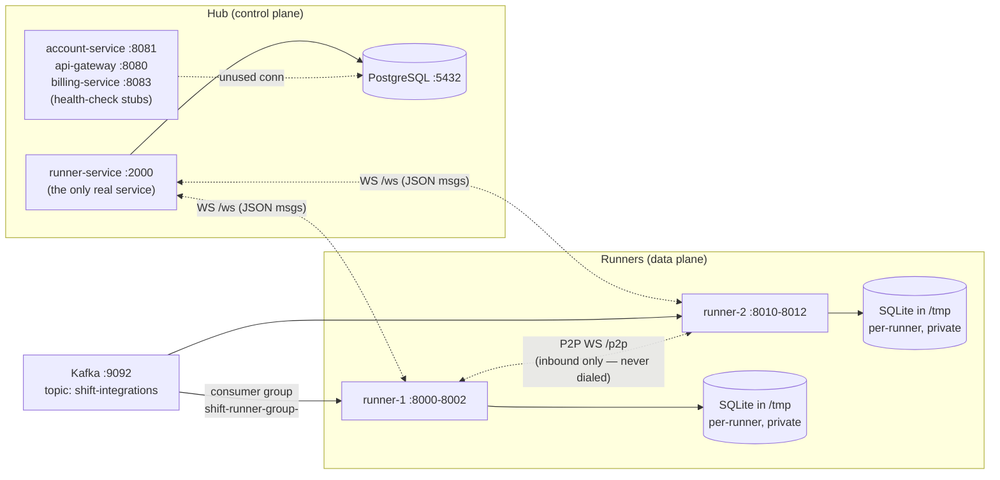

# SHIFT — Architecture As Implemented (archived prototype)

> **2026-07-19: the prototype described here was moved to `_archive/` and the platform is being rebuilt fresh.** All paths below are now relative to `_archive/` (e.g. `hub/...` → `_archive/hub/...`). Compiled binaries and `.so` artifacts were deleted.

> This documents what the code **actually does** (as of the Nov 2025 snapshot), not the intended design. For intent, read `plan.md` / `agents.md`. For the gap between the two, read `docs/REVIEW-2026-07.md`. Written to spare future readers (human or agent) re-deriving this from source.

## Topology

## Modules

Two independent Go modules, no shared package:

| Module | Path | Deps of note |
|---|---|---|
| `github.com/shift/hub` | `hub/` | pgx/v5, gorilla/websocket, uuid |
| `github.com/shift/runner` | `runner/` | mattn/go-sqlite3 (CGO), IBM/sarama (Kafka), robfig/cron/v3, gopsutil/v3, gorilla/websocket |

## Hub (`hub/`)

### Services (`hub/cmd/*`)
- **runner-service** (`cmd/runner-service/main.go`, 656 LOC) — everything real lives here:
  - `GET /ws` — WebSocket for runners *and* the UI (UI distinguished by `?type=ui`). On runner connect: registers it, then (after 100 ms sleep, in a goroutine) sends `GroupConfig`, `TimeSync`, and every deployed flow as `DeployFlow`.
  - `POST /api/integrations/create-test` — creates the hardcoded 2-step demo flow (HTTP GET to a beeceptor URL, then sleep 90 s) and deploys it.
  - `POST /api/integrations/trigger` — broadcasts an `ExecuteTask` message.
  - `GET /api/connectors/{name}/{version|latest}` and `.../download` — connector catalog + `.so` binary download. Routes are hand-parsed with `strings.Split`, not a router.
  - `GET /api/docker/containers`, `/api/docker/logs/{name}` — shells out to the `docker` CLI (`internal/docker/client.go`); "StreamLogs" actually returns the last 100 lines, no follow.
  - `GET /ui`, `/` — serves `hub/ui/index.html`.
  - **Must run with `SERVER_PORT=2000`** — config defaults to 8080 but the UI hardcodes `ws://…:2000/ws` and the Dockerfile exposes 2000/2001.
- **account-service / api-gateway / billing-service** — byte-identical stubs: load config, open DB (unused), serve `GET /health`.
- **runner-group-manager** — instantiates a group manager then discards it; `/api/groups/` returns `501`.

### Internal packages (`hub/internal/*`)
- `websocket/hub.go` — client registry + broadcast over channels. Known race: mutates `clients` map and closes `Send` channels under `RLock` (lines 87–96, 108–122).
- `integration/manager.go` — flow persistence (JSONB `definition`), `CreateTestIntegration` (the only flow generator), `GetFlowsForGroup`. `TriggerExecution` is a no-op that just formats a task-ID string.
- `execution/manager.go` — `RecordExecutionStatus` upserts `integration_executions` from runner reports; on `completed` inserts a `usage_metrics` row (the only "billing"). `CreateExecution` exists but is never called.
- `runnergroup/manager.go` — group/runner registration, versioned group configs. Generates group secret via `crypto/rand` and stores a SHA-256 hash — **but also stores/returns the plaintext secret inside the config JSONB** (lines 117–119), which is pushed to runners over unauthenticated WS.
- `connector/` — catalog registration; `register-connectors.go` hardcodes exactly `http` and `sleep`.
- `database/postgres.go` — thin `*sql.DB` wrapper (pgx stdlib driver); no pool tuning; no context propagation.
- `docker/`, `config/`, `logger/` — CLI shell-out, env loader, printf "logger" (not structured despite comments).

### Database (`hub/migrations/schema.sql`)
Single SQL file applied by Postgres's initdb mount (see `docker-compose.yml`), no migration tool. 13 tables, UUID PKs:
`accounts`, `users` (has `oidc_subject` — no OIDC code exists), `roles` + `user_roles` (never enforced), `runner_groups`, `runners` (`registration_token`/`api_key_hash` — never validated), `runner_group_configs` (versioned JSONB + secret hash), `runner_group_status`, `integration_flows` (versioned JSONB `definition`), `connectors` (catalog + `binary_url` + `checksum`), `billing_profiles`, `usage_metrics`, `integration_executions` (status, input/output JSONB, duration/cpu/memory columns).

## Runner (`runner/`)

### Core (`cmd/runner/main.go`, 659 LOC)
Monolithic wiring: SQLite task queue → connector loader/registry → execution engine → timesync → resource monitor → scheduler → Kafka consumer → runnergroup manager → P2P hub → Hub WS client → HTTP server (`/health`, `/p2p`, `/api/metrics`, `/api/scheduled-tasks`, `/api/connectors`, static UI from `./ui` — **CWD-relative**, breaks if not run from module root). All message handling is inline closures in main. ~6 background goroutine loops (1 s task poll, heartbeat, two overlapping metrics broadcasters at 5 s and 10 s, stuck-task recovery, hub connect retry).

### Execution path (the part that matters for perf goals)
1. Task arrives via Hub WS `ExecuteTask`, Kafka message, or cron schedule → inserted into **local** SQLite (`os.TempDir()/shift-runner-<id>.db`, WAL mode) with the full input payload as TEXT.
2. Poll loop claims via atomic `UPDATE … WHERE status='pending' … RETURNING` (`taskqueue/queue.go:111-121`) — correct idiom, but the DB is private so it only coordinates the runner with itself.
3. `execution/engine.go` runs steps **sequentially** (`FlowDefinition{Steps []FlowStep}` — no DAG/branching/parallelism). Input unmarshaled to `map[string]interface{}`; each step's output threaded to the next via `InputMapping` + `resolvePath` (top-level `$.field` only). Contains leftover simulation: hardcoded `time.Sleep(100ms)` at engine.go:135; per-task CPU/memory metrics are fabricated (wall-clock as CPU; racy global `MemStats.Alloc` delta).
4. Result envelope re-embeds input + all step outputs + final output, re-marshals, writes to SQLite, reports `ExecutionStatus` to hub.
5. Everything is whole-payload buffered; no streaming primitives exist anywhere.

### Connector plugins
Go **native `plugin` package** (`connector/loader.go`) — not RPC as `api_contracts.md` specifies. On `DeployFlow`, the runner fetches metadata from the hub (`/api/connectors/...`), downloads the `.so`, SHA-256-verifies (by reading the whole file into memory), `plugin.Open`s it, looks up the `Connector` symbol (`func() connector.Connector`), and registers it. Interface: `Connect(ctx, configJSON) / Execute(ctx, actionID, inputJSON) ([]byte, error) / Shutdown(ctx)`. Constraints: exact Go toolchain + dep + flag match with the host binary (see `scripts/build-connectors.sh`), Linux/macOS only, never unloadable. Built-ins in `internal/connector/{http,sleep}.go` are dead code — never registered; no hub ⇒ empty registry ⇒ every step fails.
**Registry has no mutex** (`connector/interface.go:20-40`) — data race between the register (WS handler) and get (execution) goroutines.

### Task distribution reality
- **Kafka consumer group** (`internal/kafka/consumer.go`, sarama) is the only working cross-runner sharding: group `shift-runner-group-<groupID>`, topic `shift-integrations`, round-robin. `kafka.Producer` is defined but never used — nothing in this repo publishes; messages must be produced externally.
- **Scheduler** (`internal/scheduler`) uses deterministic task IDs + duplicate-insert dedup + load-proportional delay to coordinate group members — broken across runners because each has a private DB: **every runner in a group executes every scheduled flow**.
- **P2P** (`internal/websocket/p2p.go`): inbound `/p2p` WS hub broadcasts metrics/timesync; outbound peer dialing was never written (`main.go:388` `// TODO`). GroupSecret is computed but never checked; `peer_id` comes from a query param. Same mutate-under-`RLock` race as the hub's WS hub (p2p.go:72–82).
- **Hub WS client** (`hub_client.go`): retries only until the first successful connect; an established connection that drops is never re-dialed. Full send buffers silently drop messages.

## Message protocol (JSON over WS)

`Message{type, payload, timestamp, from, to}`. Types in use:
- Hub → runner: `GroupConfig`, `TimeSync`, `DeployFlow`, `ExecuteTask`
- Runner → hub: `ExecutionStatus`, heartbeat/metrics (`ResourceMetrics`)
- Everything the hub receives is also mirrored to UI clients; the runner mirrors hub messages into its P2P broadcast.

## Ports (docker-compose)

| Service | Container port | Host |
|---|---|---|
| postgres | 5432 | 5432 |
| runner-service | 2000 (+2001 exposed) | 2000/2001 |
| api-gateway (stub) | 8080 | 8080 |
| account-service (stub) | 8080 | 8081 |
| billing-service (stub) | 8080 | 8083 |
| runner-1 api/ui/p2p | 8000/8001/8002 | 8000-8002 |
| runner-2 api/ui/p2p | 8000/8001/8002 | 8010-8012 |
| kafka (PLAINTEXT) | 9092 | 9092 |

Credentials everywhere: `shift`/`shift`/`shift` (dev only). runner-service mounts `/var/run/docker.sock` for the log-viewer feature.

## Dead / vestigial code inventory
- hub: account/api-gateway/billing stubs; `execution.CreateExecution`; `runner-group-manager` cmd; `[DEBUG] fmt.Printf` scaffolding in runner-service main.
- runner: `kafka.Producer`; `runnergroup.GetGroupSecret`/`IsMember`; `config.getIntEnv`/`UIPort`; `scheduler.GetBestRunner`/`ListScheduledFlows`; built-in http/sleep connectors; duplicated load-score formulas (`resource.go:91` vs `scheduler.go:82`).
- Checked-in build artifacts: `hub/{account-service,api-gateway,billing-service,runner-service}` (Mach-O), `hub/bin/`, `runner/bin/`, `hub/connectors/*.so`.
