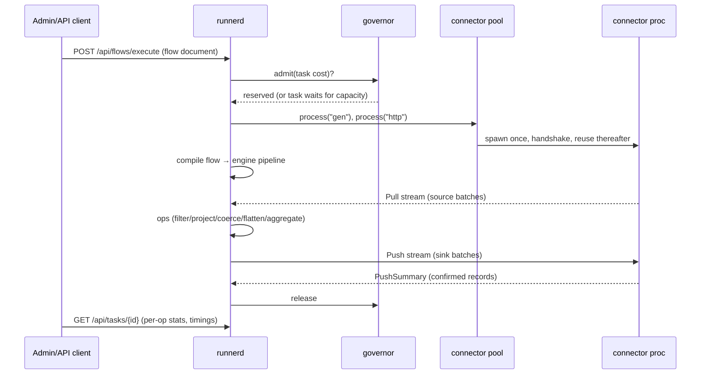

# 01 — Architecture

## The system in one paragraph

SHIFT is a hub-and-spoke iPaaS. The **hub** (M4) is an HA control plane —
identity, design studio, versioned flows, signed connector registry, and
the **durable task queue** — running as stateless Go services over HA
Postgres. **Runners** are stateless, disposable workers that lease tasks
from a hub, execute integration flows through the **streaming engine**, and
report results; a runner holds nothing durable, so killing one at any
moment loses nothing (ADR-0002). **Connectors** are standalone signed
binaries the runner spawns and streams record batches through over
gRPC/unix sockets (ADR-0001/0007). Data payloads never transit the hub —
it is on the dispatch path, not the data path.

## Modules and dependency direction

```
connectors ──▶ sdk ──▶ engine        (engine is stdlib-only, always)
runner ─────▶ sdk ──▶ engine
hub ────────▶ pkg (+ engine for shared types where needed)
pkg: tiny shared primitives only (buildinfo). Resist growing it.
```

One Go workspace (`go.work`), one module per top-level directory. Modules
reference each other with `replace ../x` directives so each also builds
standalone. Toolchain is pinned in `go.work` (currently go1.26.5 — bumped
whenever govulncheck flags a reachable stdlib CVE).

| Module | What it is | Key packages |
|---|---|---|
| `engine` | Streaming data plane. No network, no DB, no third-party deps. | `record`, `stream`, `format/*`, `spill`, `mem`, `cmd/shift-bench` |
| `sdk` | Both sides of the connector protocol. | root (author side), `host` (runner side), `sdktest`, `connectorpb` (generated) |
| `connectors` | Connector binaries. | `cmd/shift-connector-*`, `cmd/shift-bench-remote` |
| `runner` | The spoke: executes flows, exposes the dashboard/API. | `cmd/runnerd`, `internal/*` |
| `hub` | Control plane (M4 — stub today). | `cmd/hubd` |
| `proto` | gRPC contracts (not a Go module; generated code is committed). | `connector/v1` |

## How an execution flows (today, local intake; hub lease from M3b/M4)



When the hub exists, the only change is intake: instead of (only) HTTP
submissions, a lease loop pulls durable tasks from the hub's Postgres queue
(`FOR UPDATE SKIP LOCKED` + heartbeat leases) and reports status back.
Execution machinery is identical — that is deliberate: the intake is a thin
layer over the same task service (ADR-0008).

## Where state lives

| State | Where | Why |
|---|---|---|
| Flow definitions, task queue, execution history (durable) | Hub Postgres (M4) | ADR-0002: runners are disposable |
| In-flight batch data | Runner memory (arena-backed batches) | bounded by watermark |
| Operator overflow (large aggregates etc.) | Runner scratch: single unlinked spill file | ADR-0003: never file sprawl; vanishes on exit |
| Recent task results on a runner | In-memory ring (dashboard convenience) | truth lives in the hub once it exists |
| Connector sockets/tokens | 0700 temp dir per process, unlinked | ADR-0007 |

## Performance doctrine (why it's fast — measured, not asserted)

- One record's memory is never proportional to payload size: streams of
  size-bounded batches, arena allocation, spill over watermark
  (`docs/bench-M1.md`: 1 GiB at 24 MiB RSS, 80× less memory than buffered).
- Process-boundary cost is one batch frame encode/decode, not per-record
  proto (`docs/bench-M2.md`: 1.32× overhead with subprocess source+sink).
- Concurrency is admission-controlled by real resource signals, never task
  caps (ADR-0005); every task is its own goroutine(s).
